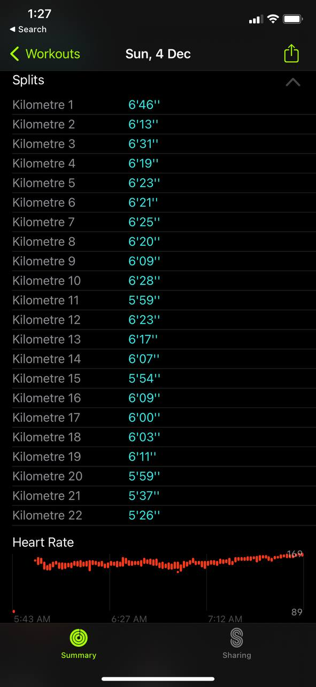
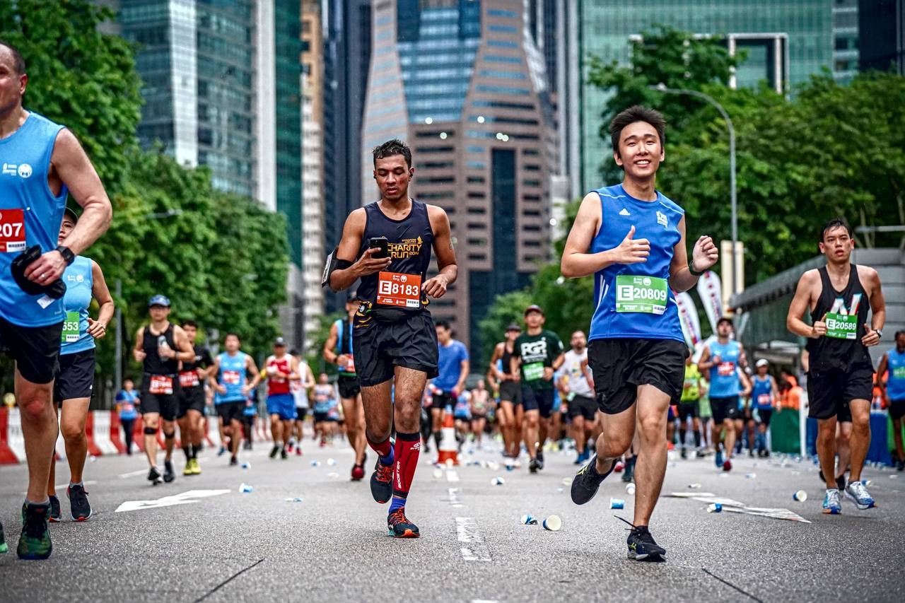

Merry Christmas!

I just wanted to write a quick (overdue) post about this race I participated in earlier this month! It was the Standard Chartered Singapore Marathon (quite a mouthful :sweat_smile:) or SCSM for short. I participated in the half marathon category and completed it in about 2 hours and 14 mins (net time) which was slightly faster than what I was aiming for.

This is not my first half-marathon; I've particpated in 3 other half-marathons (and 3 other marathons!) a few years back (before Covid). Due to the pandemic, if I'm not wrong there weren't any mass races for at least 2 years, so it's really nice to see them coming back in full force again. I'm definitely no longer as "fit" as I was back then (I'm blaming it on the pandemic :joy:) but I still think my timing was a good one!

I signed up for the half-marathon relatively late, and I didn't have a lot of time to prepare for the race. I think I had 3 months or so, and I initially planned to complete 14 training runs, gradually building up to 17 km. But that didn't work out at all :joy:, I came down with Covid and almost immediately after that I went back for reservist training. Overall, instead of 14 runs I still did 8 runs in total, with 3 runs being 10 km and more. I still did the 17 km, just that it wasn't a gradual build up :sweat_smile:. Pace wise I decided to go at a very comfortable pace for myself at around 6:20 min/km - 6:30 min/km. I didn't really push myself out of my comfort zone in this area; my goal was just to complete a half-marathon again and get back into the game.

So race day came and I did the usual: woke up at 3 am, grabbed a small bite and grabbed down (ayee :laughing:) to the place. And just before the flag off it started to rain. Actually it started to POUR and some people started to scramble for shelter but there wasn't really anywhere for a few thousand runners (where I was) to find shelter. So we all stood there, in the pouring rain, with lightning lighting up the sky (it was pretty scary), waiting for the race to start. The race was postponed due to them having to check whether the route was okay for us runners, but we eventually got going I think about 1 hour after the supposed flag off. We had a rolling start so it was a bit crowded in the first few kilometers and it was hard to maintain my pace. I was also worried that the route will be very slippery but it was actually not the case. I quite enjoyed running (and splashing) through large puddles (which many runners avoided) but I figured I was drenched anyway so why not :laughing:. Overall, for my first 10 kilometers or so I averaged around a 6:25 min/km-ish pace, although it was not as consistent as my practice runs due to there being a lot more people than in the park :sweat_smile:

Having participated in quite some races, there's this thing about such races that make you want to go faster. I think it's likely due to the excitement you have in you generated by the event, but also the competitive side of you that pushes you to keep up with or go faster than the runners alongside you. But from experience I found it really important to stick to what you are familiar with and have practiced for. It's really easy to get too caught up in the excitement and going at a pace too fast (been there done that), so I tried to stick to my plan as much as possible: to do the first 17 km at the pace I did during practice, and then I can do the last 4 km however I wished. However at the 14 km mark I felt really good, and I was getting impatient. So I decided to deviate from my plan and I increased my pace to about 6 min/km, and then in the final 1 km or so at about 5:30 min/km. It still felt quite comfortable for me, so I'm glad I went slightly faster earlier than I planned!

And that's how I did my marathon in 2 hours and 14 minutes (yes I'm very proud of myself)! I'm really happy because I proved to myself that I can still do it (!!) despite my old age :joy:. Moving on, I want to challenge myself to go faster and farther; I've set my sights on completing a full marathon in 2023! My previous marathons were around the range of 4 hours and 45 minutes to 5 hours, and my goal is to set a new PB; we'll see!

