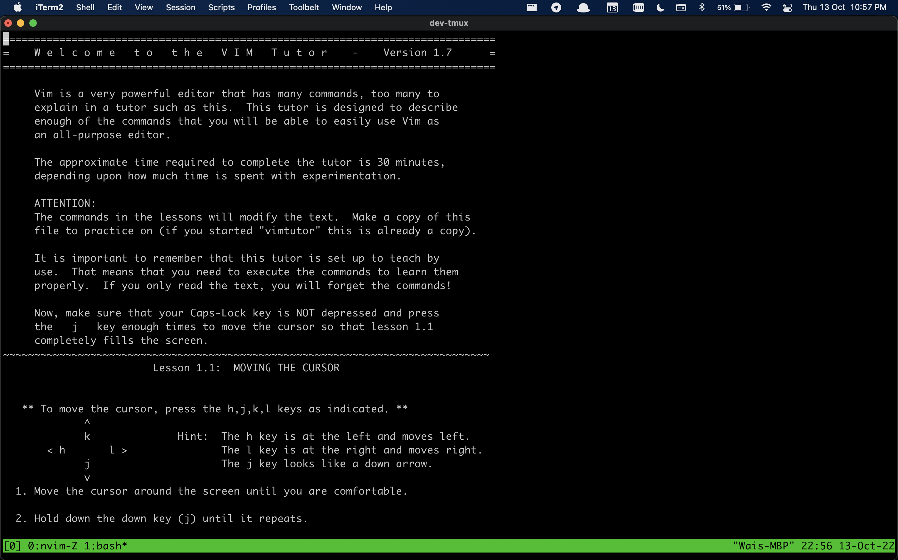
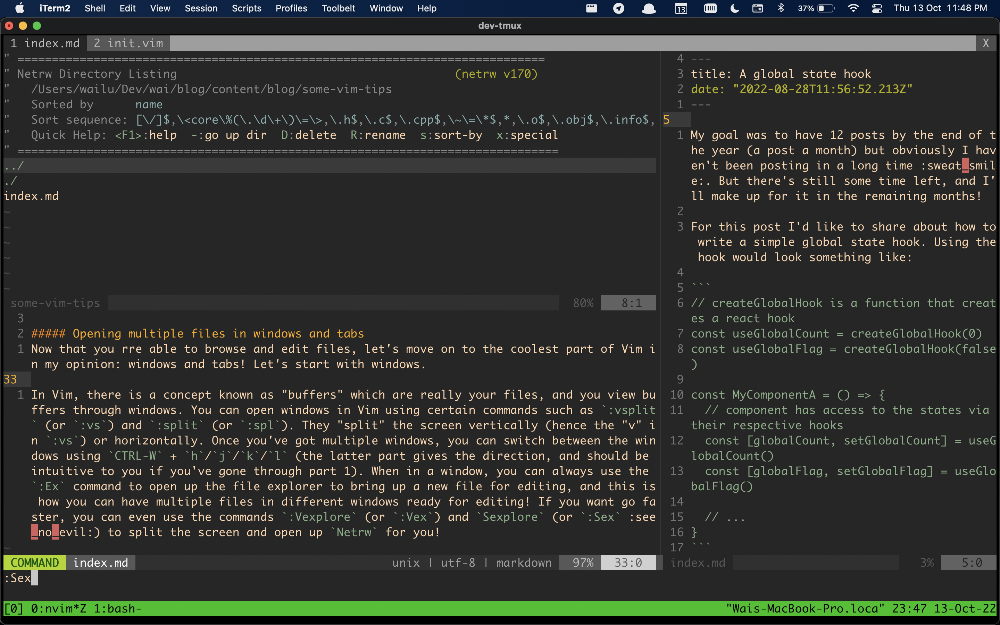
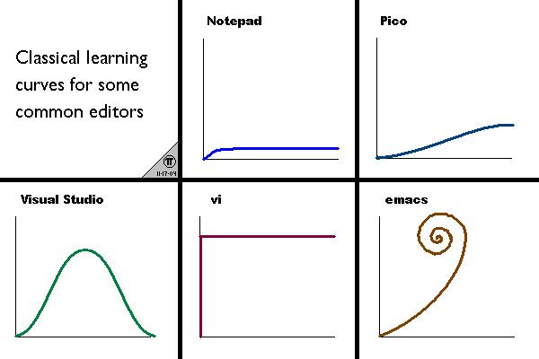

It's less than 3 months to the end of the year and I'm still a *couple* of articles off my goal :sweat_smile:. I have a few things in mind that I want to write about but it hasn't been easy to force myself to write. Writing is freaking hard :sleepy:!!

For this post I want to share about something that I myself use quite a lot: Vim! I've always wanted to write about Vim, and since I've been using it as my daily editor for a year now I thought I'd be at least somewhat qualified :stuck_out_tongue_closed_eyes:.

Before I begin, there's a very important question that needs to be answered: **Why even use Vim?**

My very honest answer to why I started using Vim was because I thought it was cool :joy:! Programming can be boring as heck, *but Vim makes you look cool doing it* :wink:. And the (fortunate) side effect was that I found myself to be more productive with Vim :sunglasses:. What was most surprising however was that it really did not take too long to be productive using Vim! Let me explain.

When it comes to using an editor, there are a couple of things that you want to be able to do with it. To me, the 3 most important things are:

1. Editing
2. Browsing files
3. Opening multiple files in different windows or tabs

Most people can agree that they are important in enabling one to write code effectively. So it follows that to be productive in Vim, the very first step is to actually know how to perform these steps!

##### Editing
If you don't already know how to edit in Vim, `vimtutor` is a program that'll get you up to speed. Simply type `vimtutor` in your command line, and then press `enter`. Then come back after you've finished the tutorial :joy:.

##### Browsing Files
Vim has its own built-in file explorer, `Netrw`. While there are definitely more popular options that you install such as `NERDTree`, I'm just going to talk about the default provided (which is what I personally use :smile:).

In Vim, you can use the `:Explore` (or `:Ex` or `:E`, as long as it is not amibiguous to Vim) command to open the `Netrw` directory listing. Use `-` and `enter` to navigate up and down folder levels respectively, and open files using `enter`. You can create a file/folder using `%` and `d` respectively, delete using `D` and rename using `R`. `Netrw` probably has a lot more key mappings than what I've listed here, but don't actually force yourself to memorise all of them!

The trick to learning Vim is not to overwhelm yourself by trying to remember all the keys at once. Just google it when you need it and they should come naturally to you; the ones that you use the most will be what you'll remember for the next time round, and the ones that you use only once in a blue moon you'll be content with just googling them everytime :smile:.

##### Opening multiple files in windows and tabs
Now that you're able to browse and edit files, let's move on to the coolest part of Vim in my opinion: windows and tabs! Let's start with windows.

In Vim, there is a concept known as "buffers" which are really your files, and you view buffers through windows. You can open windows in Vim using certain commands such as `:split` (or `:spl`) and `:vsplit` (or `:vs`). They split the screen  horizontally or vertically (when you use the "v" option as in `:vs`). Once you've got multiple windows open, you can switch focus between the windows using `Ctrl-w` + `h`/`j`/`k`/`l` (the latter part gives the direction, and should be intuitive to you if you've gone through `vimtutor`). When in a window, you can always use the `:Ex` command to open up the file explorer to bring up a new file for editing, and this is how you can have multiple files in different windows ready for editing. You can also use the commands `:Vexplore` (or `:Vex`) and `Sexplore` (or `:Sex` :see_no_evil:), which will split the screen accordingly and open up `Netrw` for you, all in one command.

Now on to tabs. In all honesty, if you're starting out with Vim you can probably do without tabs (windows should already work wonders for you). While it's really up to the user to figure out what works for them, I feel that it's really easy to misuse tabs (especially when you associate tabs in Vim to the tabs in your browser). I just want to point out one example which I feel really encapsulates the usefulness of tabs:

Imagine you have your windows all setup nicely, and you *just* have to view a file someplace else because your colleague is asking you a random question about line 53 in that file. Instead of messing up your perfect window setup, you open a new tab, navigate to that file, do whatever you need to do there and tab back once you're done.

What you've managed is to context switch to a totally different subject, all while your perfect setup stays untouched in the original tab, ready to go again :sunglasses:. That's what tabs can offer you in Vim, and (forgive me if I'm wrong but) not many editors give you the flexibility like windows + tabs in Vim. That's what makes Vim super awesome :smile:!

I'll just go through some useful commands for tabs briefly here. You can open a new tab using the command `:tabnew`. This new tab is a completely new view, and you can do any window shenanigans you know in it. To navigate between tabs, use `gt` and `gT` to navigate forwards and backwards respectively. Lastly, to close a tab, use `:tabclose`.

That's all I have to share for today! If you're interested in learning/using Vim, I hope this post has helped you in some way. Have fun! :smile_cat:

The next step after starting to use Vim is to make it your own! I'll admit I did spend a lot of time customising Vim, but ultimately what worked for me in the end was more often than not the default keybindings. I'm definitely going to write another post on my plugins and keybindings in the future, so stay tuned!! :smile_cat:

P.S. Saved the most important tip for last: use `CTRL-[` instead of `Esc`!!
