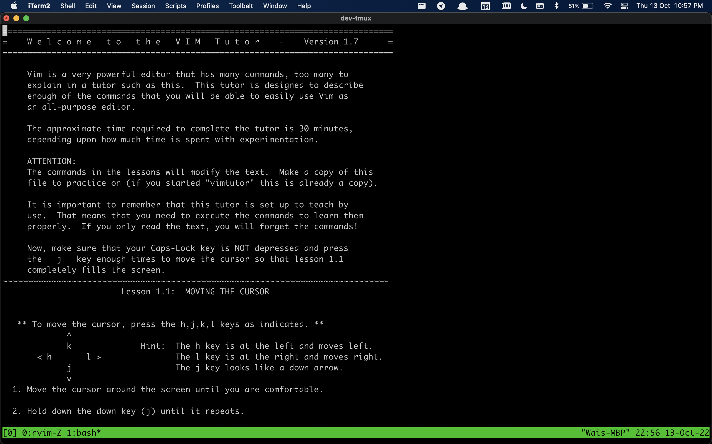
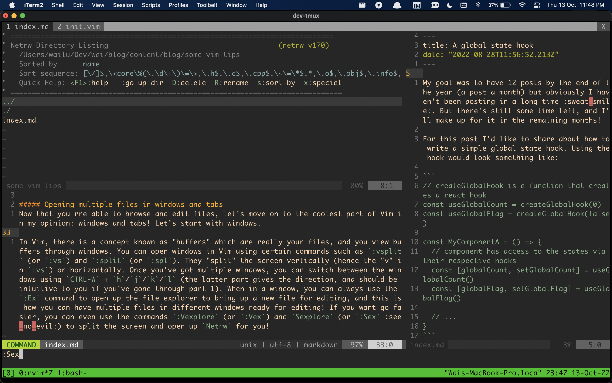

It's less than 3 months to the end of the year and I'm just article-padding now to attempt to hit my goal :sweat_smile:. I have a few things I have in mind that I want to write about but it hasn't been easy to force myself to write. (Also writing is freaking hard!! I'm not the best at it but I'm trying!) I've always wanted to write something on Vim and since I've been using Vim as my daily editor for a year now, I thought I'd be at least somewhat qualified to give some tips and pointers on Vim :stuck_out_tongue_closed_eyes:.

But before going any further, there's a very important question that needs to be answered: **Why even use Vim?**

My very honest answer to why I started to use Vim was because it's super cool looking :sunglasses:!! Programming can be boring as heck, *but Vim makes you look cool doing it* :wink:. The (fortunate :joy:) side effect I found was that I became more productive using Vim. What was most surprising however was that it did not really take that long to be productive using Vim! Let me explain.

When it comes to using any program as an editor, there are a couple of things that you should be able to do with it. To me the 3 most important things are:

1. Editing
2. Browsing files
3. Opening multiple files in different windows or tabs

I don't think this is a very controversial list; most people can agree that these are important functionalities to enable one to write code. So, the very first step to be productive in Vim is to actually know how to perform these steps!

##### Editing
If you don't already know how to edit in Vim, `vimtutor` is a program that'll get you up to speed. Simply type `vimtutor` in your command line, and then press `enter`. Then come back after you've finished the tutorial :joy:.

##### Browsing Files
Vim has it's own built-in file explorer, `Netrw`. There are definitely other more popular options that you can use such as `NERDTree`, but let's not think about plugins for now. My personal preference is also to keep my Vim setup simple, so I stuck with the default `Netrw` :smile:.

In Vim, you can use the `:Explore` (or `:Ex` or `:E`, as long as it is not amibiguous to Vim) command to open the `Netrw` directory listing. Use `-` and `enter` to navigate up and down folder levels respectively, and open files using `enter`. You can create a file/folder using `%` and `d` respectively, delete a file using `D`...

Don't actually force yourself to memorise all the keybindings! You see, the trick to learning Vim is not to overwhelm yourself by trying to remember all of the keys at once. Just google it when you need it and I promise it'll come naturally to you; the ones that you use the most will be the one that you'll remember for the next time round, and the ones that you use once in a blue moon you'll find that you'll be content with just googling them everytime :smile:. In fact, I believe this is what makes a Vim user productive; you are disallowed a mouse to perform actions and are forced to use a keyboard command instead. And if you've ever played Starcraft you'll know hotkeys beats mouse actions almost(?) everytime :joy:.

##### Opening multiple files in windows and tabs
Now that you rre able to browse and edit files, let's move on to the coolest part of Vim in my opinion: windows and tabs! Let's start with windows.

In Vim, there is a concept known as "buffers" which are really your files, and you view buffers through windows. You can open windows in Vim using certain commands such as `:vsplit` (or `:vs`) and `:split` (or `:spl`). They "split" the screen vertically (hence the "v" in `:vs`) or horizontally. Once you've got multiple windows, you can switch between the windows using `CTRL-W` + `h`/`j`/`k`/`l` (the latter part gives the direction, and should be intuitive to you if you've gone through part 1). When in a window, you can always use the `:Ex` command to open up the file explorer to bring up a new file for editing, and this is how you can have multiple files in different windows ready for editing! If you want go faster, you can even use the commands `:Vexplore` (or `:Vex`) and `Sexplore` (or `:Sex` :see_no_evil:) to split the screen and open up `Netrw` for you!

Now let's move on to tabs. In all honesty, if you're starting out with Vim I think you can probably do without tabs (windows will work wonders for you already). My understanding of how to use tabs is to see it as having a new **view**, without messing up your previous window setup. Imagine you have your windows all setup nicely for editing, and you just have to view a file some place else because your colleague is asking your some question about that file. Instead of messing up your perfect window setup, you can open a new tab, navigate to that file, do whatever you need to do there and tab back to your perfect setup. That's what tabs can offer you in Vim, and (forgive me if I'm wrong but) not many editors give you the flexibility of windows + tabs like Vim does. And that makes Vim really awesome I feel!

I'll just go through tabs briefly here. You can open a new tab using the command `:tabnew`. The new tab is a completely new view, and you can do any window shenanigans you know in it. To navigate between tabs, use `gt` and `gT` to navigate forwards and backwards respectively. Lastly, to close a tab, use `:tabclose`. And if your Vim tabs are starting to look like the ones in Google Chrome, then it's more than likely you're doing something wrong! Use them wisely and (I'll say it) seldomly!

That's all I have to share for today. If you're interested in Vim, I hope this post has given you some idea on how to get started using Vim. After this hurdle comes the obsession part :joy:. It's kind of like a hobby; i'm thinking similar to mechanical keyboards. You know how there are people who spend a lot of time building and customising their mechanical keyboards? You can do that for Vim too, with plugins and key bindings and all. I'll admit I spent a lot of time customising Vim, but ultimately what sticked in the end was more often than not the default keybindings. I'm definitely going to write another post on my plugins in the future, so stay tuned!! :smile_cat:

P.S. Saved the most important tip for last: use `CTRL-[` instead of `Esc`!!
